# OurTrips

This is a fully functional social media app, which focuses on where did the photos taken.

This is currently the first sprint of the app there plans to continue it with new features.

The project builds around Firebase.
It uses : 
-Authentication
-FireStore Database
-Storage
-Cloud functions(For Notifications, and Database consistency functions)
-Google Maps

# Setting up
The project requires Blaze plan to use Cloud Functions.
- Clone this repository
- Create a Firebase project in the Firebase Console
- Follow these steps to register Make it So app in your Firebase project
Follow these steps to add the Firebase Android configuration file to Make it So
- Create a Cloud Firestore database in your Firebase project
- Enable Email/Password Authentication in your Firebase project
- Enable Cloud Storage
- Enable Cloud Functions, in the functions directory the cloud functions can be found(In the a placeholder add a public placeholderimageUrl)
- Run the app using Android Studio Flamingo+ on a device/emulator with API "UpsideDownCake" or above

# Used Android Specific Technologies:
- [Compose-Destinations](https://github.com/raamcosta/compose-destinations) for navigation
- [Material-3](https://developer.android.com/jetpack/compose/designsystems/material3) the app reflects the current users style-theme
- [Paging 3](https://developer.android.com/topic/libraries/architecture/paging/v3-overview) used for pagination on the homescreen
- [Dagger-Hilt](https://developer.android.com/training/dependency-injection/hilt-android) used for dependecy injection

# Screenshots

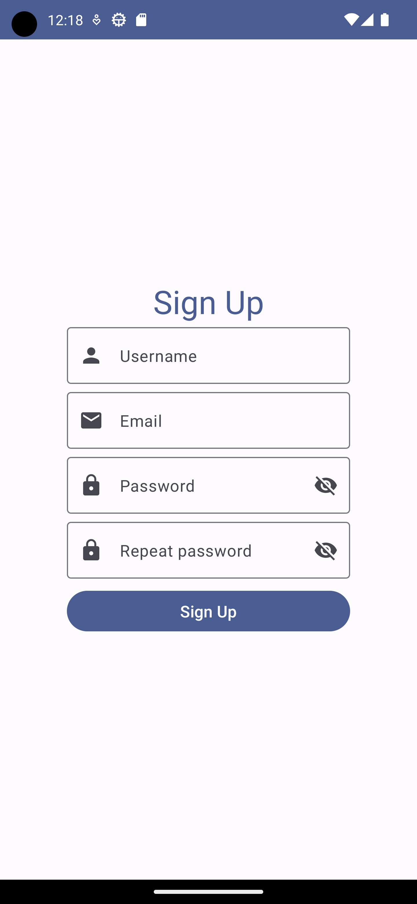

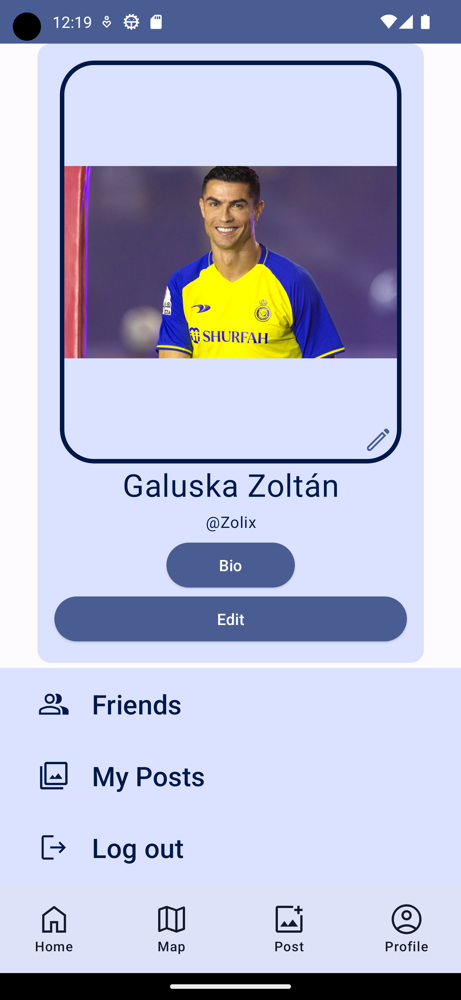
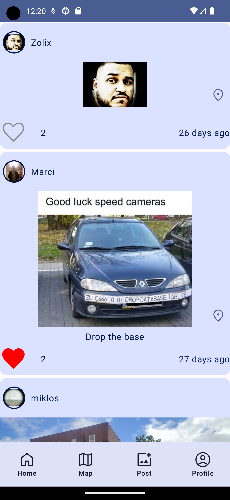
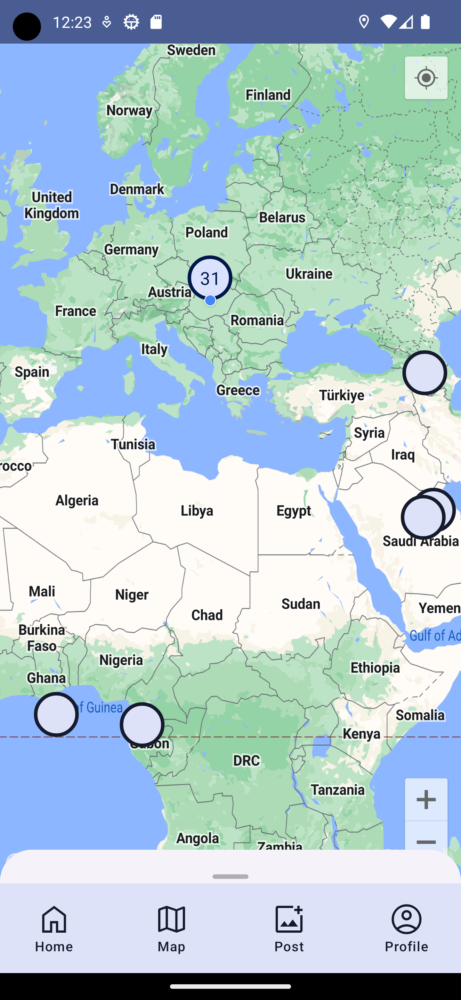
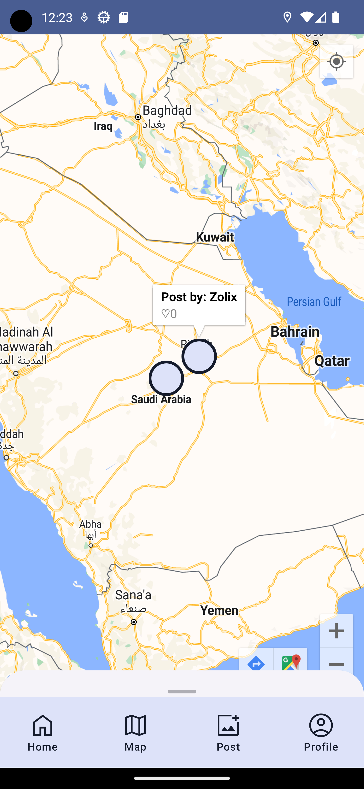
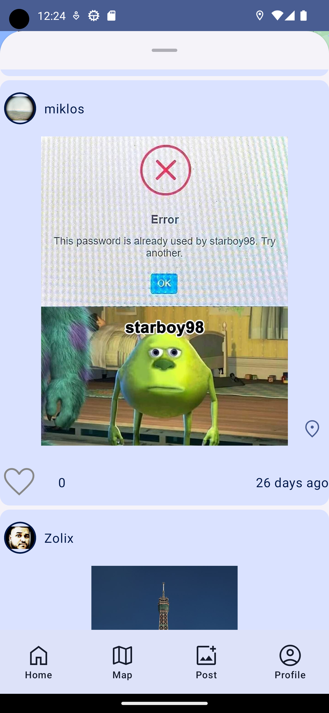

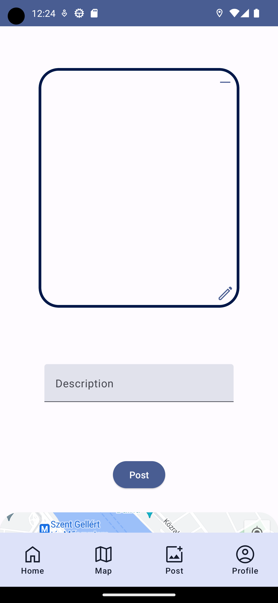
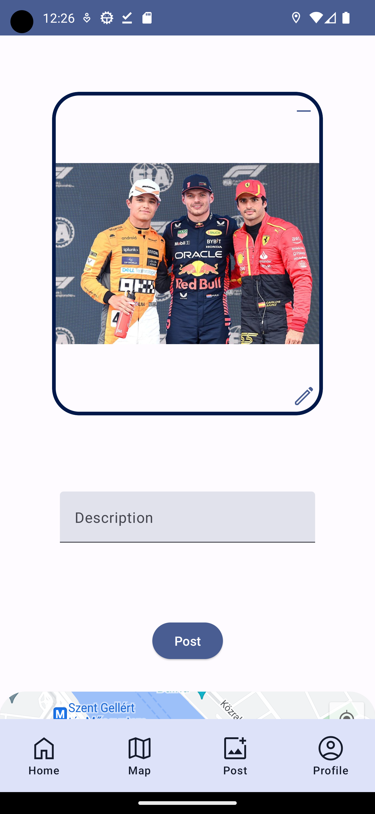
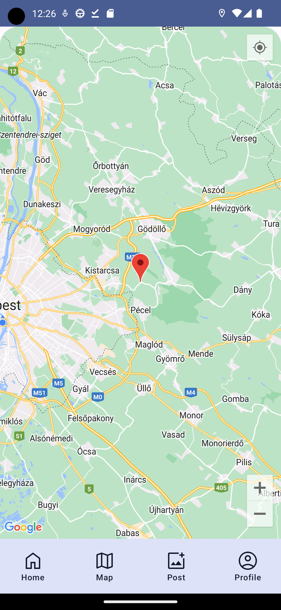

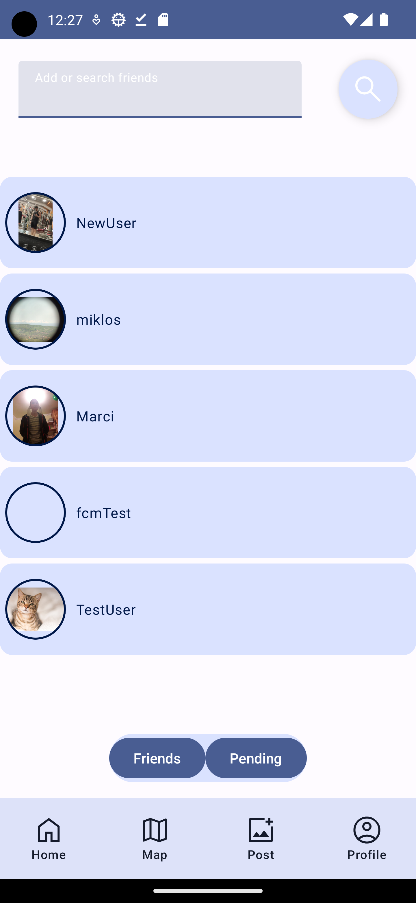
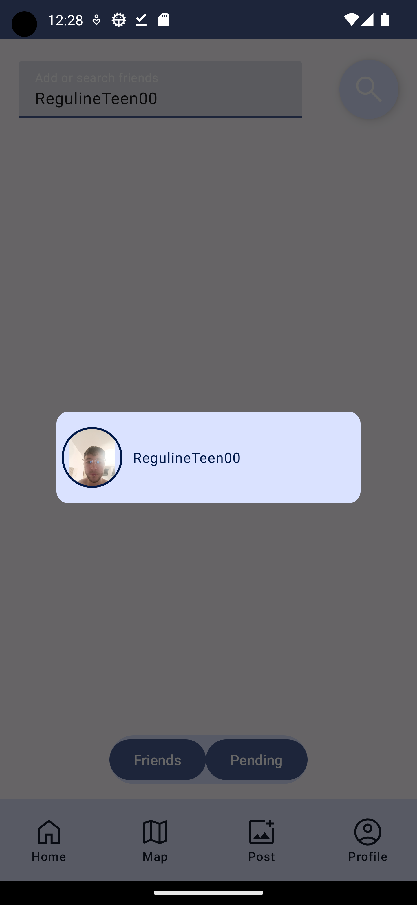
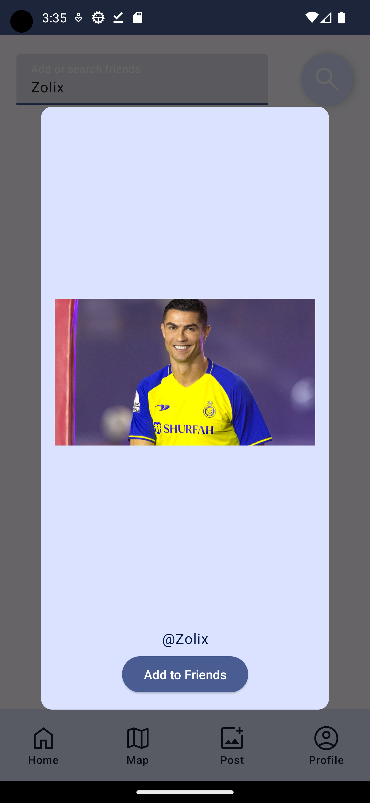

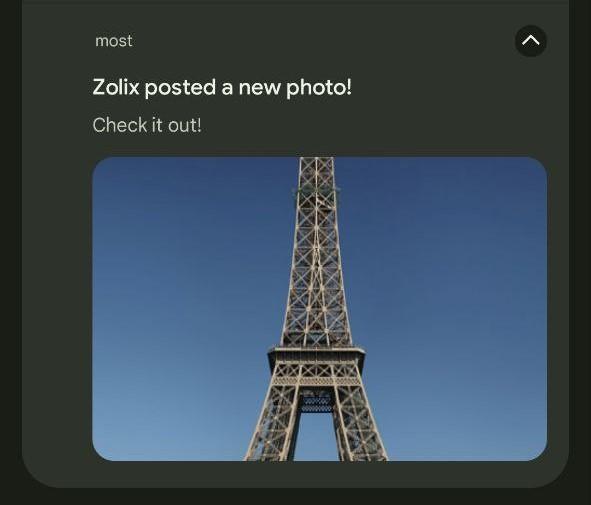
